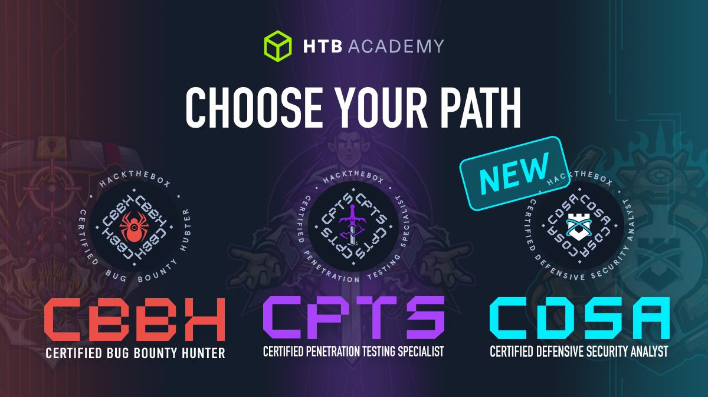

# Decoding Omniscient

Once upon a time, there was a brilliant hacker, who wanted to take their hacking skills to the next level.\
They decided to try the Hack the Box Pro Labs.\
The hacker started by signing up for the Pro Labs and selecting the lab they wanted to work on.\
\
It was a fairly long lab filled with challenges and tricks.

The hacker navigated through the lab using their hacking skills, deciphering passwords and [#cracking](https://www.linkedin.com/feed/hashtag/?keywords=cracking\&highlightedUpdateUrns=urn%3Ali%3Aactivity%3A7125473394602459136) complex algorithms.

<figure><figcaption></figcaption></figure>

It was a long but rewarding journey.

The hacker was learning a lot of new skills and becoming more confident in their abilities.\
The hacker made it to the end of the lab with flying colors.

They had learned a lot and were feeling more confident than ever.

With their newfound knowledge, they started hacking different websites and networks.&#x20;

They were getting better and better results as they kept trying and practicing.

The hacker even created some tools to [#automate](https://www.linkedin.com/feed/hashtag/?keywords=automate\&highlightedUpdateUrns=urn%3Ali%3Aactivity%3A7125473394602459136) the process, making it even easier to hack.

They thought that their hacking skills could be put to good use and decided to use them for good by helping those in need.

The [#hacker](https://www.linkedin.com/feed/hashtag/?keywords=hacker\&highlightedUpdateUrns=urn%3Ali%3Aactivity%3A7125473394602459136) was now an expert in their field and had used the Hack the Box Pro Labs to get to where they are now.

It was a journey they will never forget.\
[#htb](https://www.linkedin.com/feed/hashtag/?keywords=htb\&highlightedUpdateUrns=urn%3Ali%3Aactivity%3A7125473394602459136) [#prolabs](https://www.linkedin.com/feed/hashtag/?keywords=prolabs\&highlightedUpdateUrns=urn%3Ali%3Aactivity%3A7125473394602459136) [#redteam](https://www.linkedin.com/feed/hashtag/?keywords=redteam\&highlightedUpdateUrns=urn%3Ali%3Aactivity%3A7125473394602459136) [#poplabsec](https://www.linkedin.com/feed/hashtag/?keywords=poplabsec\&highlightedUpdateUrns=urn%3Ali%3Aactivity%3A7125473394602459136)


