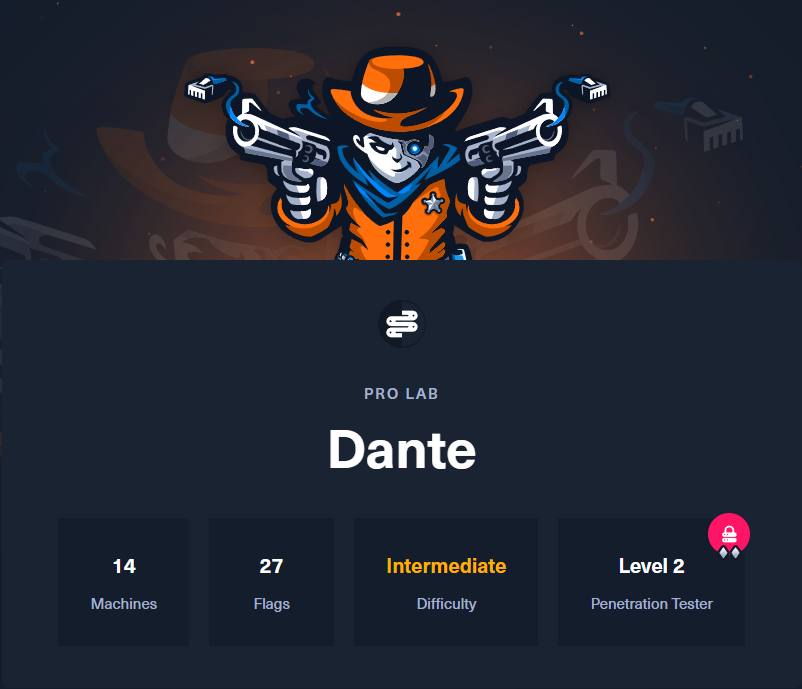

# Dante

### Who can benefit from Dante?&#x20;

Dante is designed to cater to beginners in information security and junior pentesters. It focuses on highlighting common vulnerabilities, misconfigurations, and attack paths that are encountered in real-life engagements.&#x20;

Participating in Dante can be a great way for users to enhance their understanding and gain experience in both Linux and Windows exploitation.

<figure><figcaption></figcaption></figure>

### The ideal training environment for beginners!

#### SKILLS / KNOWLEDGE

* Familiarity with modern tools and techniques used to perform penetration testing engagements
* Good knowledge of networking and web application attacks
* A good understanding of Linux and Windows operating systems and Active Directory

#### ATTITUDE / MENTALITY

* Patience and perseverance
* Willingness to do extensive research
* Accept that you might fail more times than you will succeed; it’s part of the process

<figure><figcaption></figcaption></figure>
